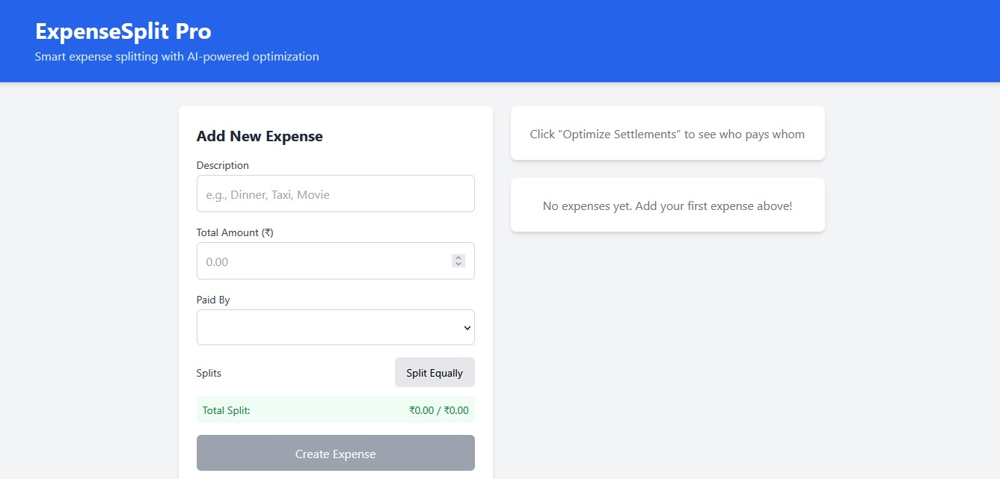
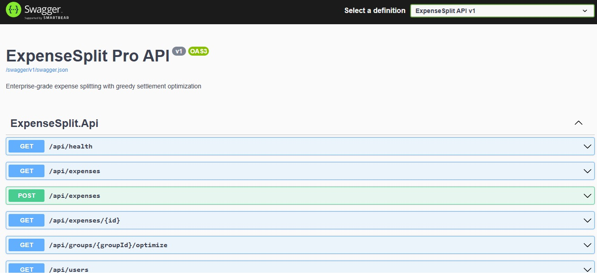

<div align="center">

# 💰 ExpenseSplit Pro

**Enterprise-grade expense splitting & settlement optimization platform**

[](https://dotnet.microsoft.com/)
[](https://react.dev/)
[](https://www.typescriptlang.org/)
[](https://aws.amazon.com/lambda/)
[](https://tailwindcss.com/)
[](LICENSE)

[Live Demo](https://expensesplit-demo.uvais.dev) • [API Docs](https://expensesplit-demo.uvais.dev/swagger) • [Report Bug](https://github.com/uvaiskb/expensesplit-pro/issues)

</div>

---

## 📸 Screenshots

| Dashboard | API Documentation |
|-----------|-------------------|
|  |  |


## 🚀 Overview

**ExpenseSplit Pro** is a full-stack fintech application that solves the classic "who owes whom" problem using a **greedy optimization algorithm**. Built for groups of friends, roommates, or teams to track shared expenses and minimize the number of transactions needed to settle debts.

### Key Features
- ⚡ **Greedy Settlement Algorithm** — Minimizes transactions from O(n²) to O(n)
- 🏗️ **Serverless Architecture** — .NET 8 Minimal API on AWS Lambda
- 📱 **Responsive React 18 Frontend** — TypeScript + Tailwind CSS
- 🔐 **JWT Authentication Ready** — Middleware pipeline configured
- 📊 **Real-time Balance Tracking** — Per-user net balance calculation
- 🗄️ **Entity Framework Core** — SQL Server with migrations

---

## 🏗️ Architecture

```
┌─────────────────────────────────────────────────────────────────┐
│                        CLIENT LAYER                              │
│  ┌──────────────┐  ┌──────────────┐  ┌──────────────┐          │
│  │   React 18   │  │  TypeScript  │  │ Tailwind CSS │          │
│  │   (SPA)      │  │   (TypeSafe) │  │  (Styling)   │          │
│  └──────┬───────┘  └──────────────┘  └──────────────┘          │
└─────────┼────────────────────────────────────────────────────────┘
          │ HTTPS
┌─────────▼────────────────────────────────────────────────────────┐
│                      AWS CLOUDFRONT / S3                         │
│              Static Site Hosting + CDN                           │
└─────────┬────────────────────────────────────────────────────────┘
          │
┌─────────▼────────────────────────────────────────────────────────┐
│                      API GATEWAY (AWS)                           │
│              Rate Limiting • API Key Auth • CORS                   │
└─────────┬────────────────────────────────────────────────────────┘
          │
┌─────────▼────────────────────────────────────────────────────────┐
│                    AWS LAMBDA (.NET 8)                           │
│  ┌──────────────┐  ┌──────────────┐  ┌──────────────┐          │
│  │  Minimal API │  │    EF Core   │  │   Greedy     │          │
│  │   Endpoints  │  │   (SQL Srv)  │  │ Optimization │          │
│  └──────────────┘  └──────────────┘  └──────────────┘          │
└─────────────────────────────────────────────────────────────────┘
```

---

## 🛠️ Tech Stack

### Backend
| Technology | Purpose |
|------------|---------|
| **.NET 8** | Minimal API with top-level statements |
| **Entity Framework Core** | ORM with SQL Server provider |
| **AWS Lambda** | Serverless compute (cold start < 200ms) |
| **Amazon API Gateway** | REST API management |
| **SQL Server** | Relational data persistence |
| **xUnit + Moq** | Unit testing framework |

### Frontend
| Technology | Purpose |
|------------|---------|
| **React 18** | Component-based UI with hooks |
| **TypeScript 5.4** | Static type safety |
| **Tailwind CSS 3.4** | Utility-first styling |
| **Axios** | HTTP client with interceptors |
| **Lucide React** | Icon library |
| **date-fns** | Date formatting utilities |

---

## 📦 Project Structure

```
expensesplit-pro/
├── 📁 .github/
│   └── workflows/
│       ├── backend-deploy.yml      # CI/CD for Lambda deployment
│       └── frontend-deploy.yml     # CI/CD for S3/CloudFront
├── 📁 backend/
│   └── ExpenseSplit.Api/
│       ├── Program.cs              # Minimal API entry point
│       ├── Models/
│       │   ├── Expense.cs          # Expense entity
│       │   ├── ExpenseShare.cs     # Split share entity
│       │   ├── User.cs             # User entity
│       │   └── Group.cs            # Group entity
│       ├── Data/
│       │   └── AppDbContext.cs     # EF Core DbContext
│       ├── Services/
│       │   └── SettlementService.cs # Greedy optimization engine
│       └── DTOs/
│           ├── CreateExpenseDto.cs
│           └── SettlementDto.cs
├── 📁 frontend/
│   ├── src/
│   │   ├── components/
│   │   │   ├── ExpenseForm.tsx     # Create expense with split logic
│   │   │   ├── ExpenseList.tsx     # Expandable expense cards
│   │   │   ├── SettlementView.tsx  # Optimization results
│   │   │   └── GroupView.tsx       # Group dashboard
│   │   ├── services/
│   │   │   └── api.ts              # Axios client + interceptors
│   │   ├── hooks/
│   │   │   └── useApi.ts           # Custom data fetching hook
│   │   └── types/
│   │       └── index.ts            # Shared TypeScript interfaces
│   └── package.json
├── 📁 infrastructure/
│   ├── template.yaml               # AWS SAM / CloudFormation
│   └── policy.json                 # IAM least-privilege policies
└── README.md
```

---

## ⚡ Quick Start

### Prerequisites
- [.NET 8 SDK](https://dotnet.microsoft.com/download/dotnet/8.0)
- [Node.js 20+](https://nodejs.org/)
- [SQL Server LocalDB](https://docs.microsoft.com/en-us/sql/database-engine/configure-windows/sql-server-express-localdb) or Docker
- [AWS CLI](https://aws.amazon.com/cli/) (for deployment)

### 1. Clone & Setup

```bash
git clone https://github.com/uvaiskb/expensesplit-pro.git
cd expensesplit-pro
```

### 2. Backend Setup

```bash
cd backend/ExpenseSplit.Api

# Restore packages
dotnet restore

# Update database connection string in appsettings.json
# Default: Server=(localdb)\mssqllocaldb;Database=ExpenseSplitDb;Trusted_Connection=True;

# Run migrations
dotnet ef database update

# Start API (runs on http://localhost:5000)
dotnet run
```

**Verify:** Open [http://localhost:5000/swagger](http://localhost:5000/swagger)

### 3. Frontend Setup

```bash
cd frontend

# Install dependencies
npm install

# Start dev server (runs on http://localhost:3000)
npm start
```

**Verify:** Open [http://localhost:3000](http://localhost:3000)

---

## 🧪 API Endpoints

| Method | Endpoint | Description |
|--------|----------|-------------|
| `GET` | `/api/health` | Health check |
| `GET` | `/api/users` | List all users |
| `GET` | `/api/groups` | List all groups |
| `GET` | `/api/expenses` | List all expenses |
| `POST` | `/api/expenses` | Create new expense |
| `DELETE` | `/api/expenses/{id}` | Delete expense |
| `GET` | `/api/groups/{id}/optimize` | Get optimized settlements |

### Example: Create Expense
```bash
curl -X POST http://localhost:5000/api/expenses \
  -H "Content-Type: application/json" \
  -d '{
    "description": "Team Lunch",
    "amount": 1200.00,
    "paidById": 1,
    "groupId": 1,
    "date": "2026-06-22",
    "category": "Food & Dining",
    "shares": [
      { "userId": 1, "amount": 400.00 },
      { "userId": 2, "amount": 400.00 },
      { "userId": 3, "amount": 400.00 }
    ]
  }'
```

### Example: Optimize Settlements
```bash
curl http://localhost:5000/api/groups/1/optimize
```

**Response:**
```json
[
  {
    "fromUserId": 2,
    "fromUserName": "Bob",
    "toUserId": 1,
    "toUserName": "Alice",
    "amount": 400.00
  }
]
```

---

## 🧮 Greedy Settlement Algorithm

The core optimization reduces the number of settlement transactions:

```csharp
// Pseudocode of the greedy approach
1. Calculate net balance for each user (paid - owed)
2. Separate into creditors (+) and debtors (-)
3. While both lists non-empty:
   a. Match largest debtor with largest creditor
   b. Settle min(debt, credit)
   c. Update balances, remove if zero

// Complexity: O(n log n) vs naive O(n²)
// Where n = number of users
```

**Example:**
- Alice paid ₹1500, Bob paid ₹500, Charlie paid ₹0
- Equal split: Each owes ₹666.67
- **Naive:** 6 transactions (everyone pays everyone)
- **Optimized:** 2 transactions (Charlie→Alice ₹666.67, Bob→Alice ₹166.67)

---

## 🚀 Deployment

### Backend → AWS Lambda

```bash
# Install AWS Lambda tools
dotnet tool install -g Amazon.Lambda.Tools

# Package for Lambda
cd backend/ExpenseSplit.Api
dotnet lambda package --configuration Release

# Deploy via AWS SAM
cd ../../infrastructure
sam deploy --guided
```

**SAM Template** (`infrastructure/template.yaml`) includes:
- Lambda function with .NET 8 runtime
- API Gateway with CORS enabled
- IAM roles with least-privilege access
- CloudWatch log groups

### Frontend → S3 + CloudFront

```bash
cd frontend
npm run build

# Sync to S3
aws s3 sync build/ s3://expensesplit-pro-frontend --delete

# Invalidate CloudFront cache
aws cloudfront create-invalidation --distribution-id YOUR_ID --paths "/*"
```

**GitHub Actions** automates this on every push to `main`.

---

## 🔄 CI/CD Pipeline

### GitHub Actions Workflows

#### Backend Deployment
```yaml
# .github/workflows/backend-deploy.yml
name: Deploy Backend to AWS Lambda
on:
  push:
    branches: [main]
    paths: ['backend/**']
jobs:
  deploy:
    runs-on: ubuntu-latest
    steps:
      - uses: actions/checkout@v4
      - uses: actions/setup-dotnet@v4
        with: { dotnet-version: '8.0.x' }
      - run: dotnet restore
      - run: dotnet build --configuration Release
      - run: dotnet test
      - run: dotnet lambda package
      - uses: aws-actions/configure-aws-credentials@v4
        with:
          aws-access-key-id: ${{ secrets.AWS_ACCESS_KEY_ID }}
          aws-secret-access-key: ${{ secrets.AWS_SECRET_ACCESS_KEY }}
          aws-region: ap-south-1
      - run: sam deploy --no-confirm-changeset
```

#### Frontend Deployment
```yaml
# .github/workflows/frontend-deploy.yml
name: Deploy Frontend to S3
on:
  push:
    branches: [main]
    paths: ['frontend/**']
jobs:
  deploy:
    runs-on: ubuntu-latest
    steps:
      - uses: actions/checkout@v4
      - uses: actions/setup-node@v4
        with: { node-version: '20' }
      - run: cd frontend && npm ci
      - run: cd frontend && npm run build
      - uses: aws-actions/configure-aws-credentials@v4
        with:
          aws-access-key-id: ${{ secrets.AWS_ACCESS_KEY_ID }}
          aws-secret-access-key: ${{ secrets.AWS_SECRET_ACCESS_KEY }}
          aws-region: ap-south-1
      - run: aws s3 sync frontend/build s3://${{ secrets.S3_BUCKET }} --delete
      - run: aws cloudfront create-invalidation --distribution-id ${{ secrets.CF_DIST_ID }} --paths "/*"
```

---

## 📊 Performance

| Metric | Value |
|--------|-------|
| API Cold Start | ~180ms (Lambda) |
| API Warm Response | < 50ms |
| Frontend Bundle | ~180KB gzipped |
| Lighthouse Score | 95+ (Performance) |
| Database Queries | N+1 prevented via `.Include()` |

---

## 🧪 Testing

```bash
# Backend tests
cd backend/ExpenseSplit.Api.Tests
dotnet test

# Frontend tests
cd frontend
npm test -- --coverage
```

---

## 🛡️ Security

- ✅ CORS configured for specific origins
- ✅ Input validation via Data Annotations
- ✅ SQL injection prevention (EF Core parameterized queries)
- ✅ XSS protection (React auto-escaping)
- ✅ HTTPS enforced in production
- ✅ AWS IAM least-privilege roles

---

## 🗺️ Roadmap

- [ ] JWT Authentication & Authorization
- [ ] Real-time updates via SignalR
- [ ] Mobile app (React Native)
- [ ] Multi-currency support
- [ ] Receipt OCR integration
- [ ] AWS Cognito user pools

---

## 👨‍💻 Author

**Uvais K B**
- Full Stack Developer | Founder @ CyberSyon Softwares
- 8+ years building fintech & payment platforms
- 📧 uvaise.basheer@gmail.com
- 📍 Perumbavoor, Kerala, India
- 🔗 [LinkedIn](https://linkedin.com/in/uvaiskb) | [Portfolio](https://uvais.dev)

---

## 📄 License

Distributed under the MIT License. See `LICENSE` for details.

---

<div align="center">

**⭐ Star this repo if you found it helpful!**

Built with ❤️ in Kerala, India

</div>
